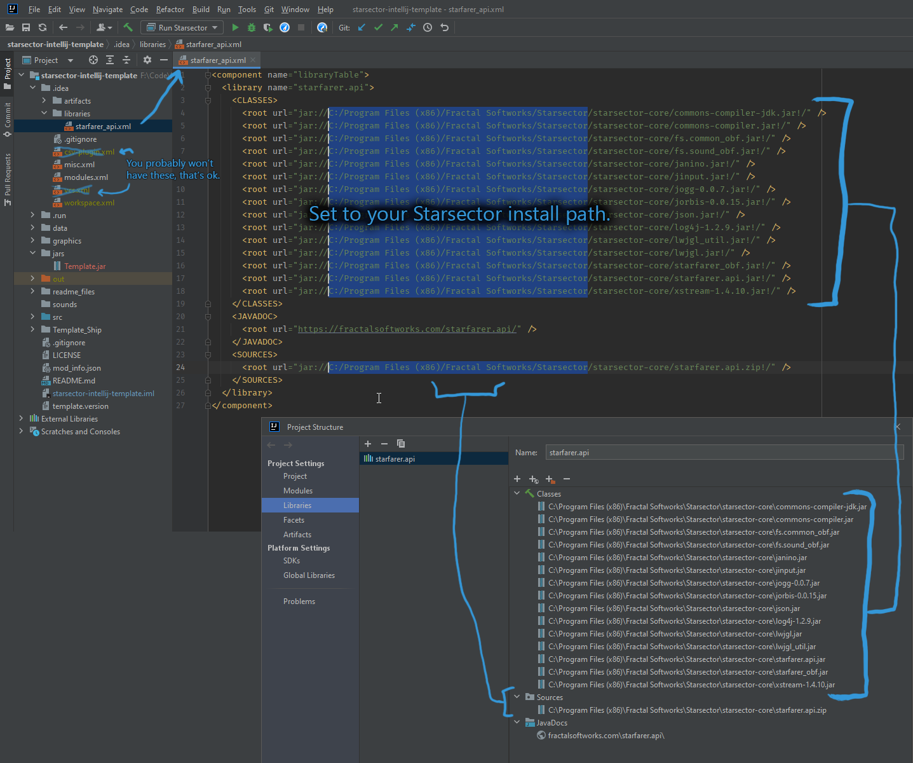
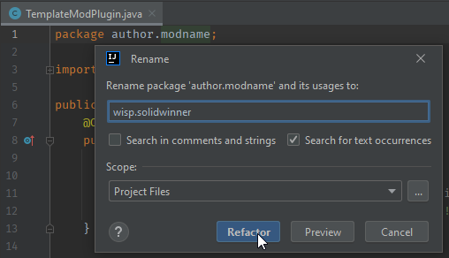
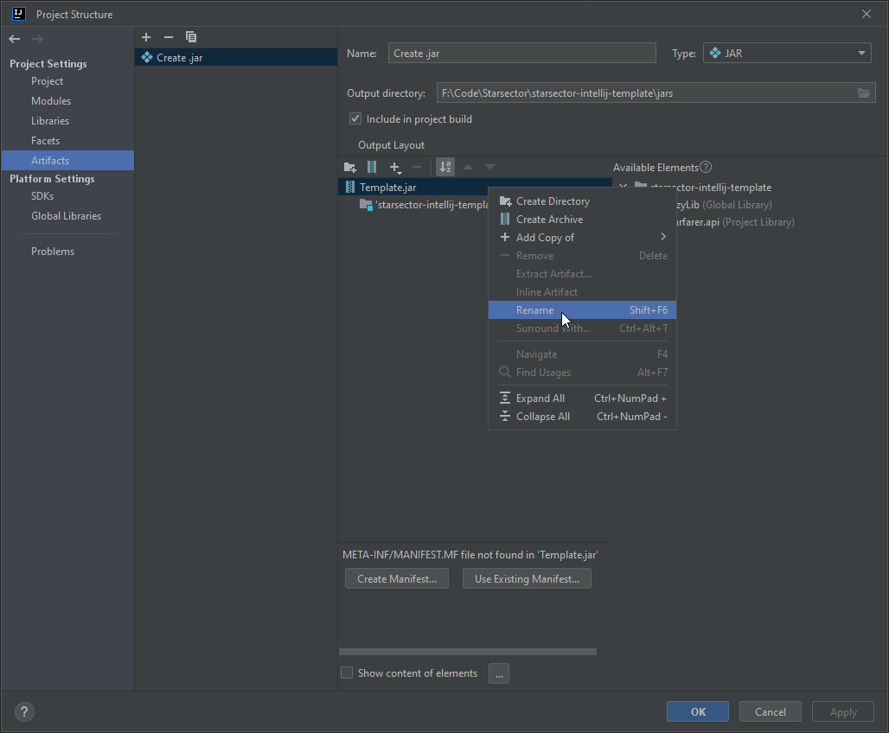

# Second Playthrou - a Starsector Mod

v0.1.0

## Description

This mod aims to improve the replayability of the game Starsector.

## Content (controlled via Luna Lib settings)

### Done

#### Randomizing of the Coreworlds without breaking of missions
    - Repositioning
    - Changing of uninhabited planets
    - Partial changing of inhabited worlds 

 
#### Repositioning of Mod factions
    - either to the core or just around the map
    - maintain each AI faction systems grouped (WIP)
    - moves UAF to the border of deep hyperspace (WIP) 
 
 
#### Disabling access penalties for distance from the core worlds  
    -
    ```html  ``` 

#### Disabling access penalties for distance from the core worlds

```html


### WIP

#### Custom Start Bonuses
    - Fathers Logbook
        - preliminary survey data / full survey data of X(0-100) percent of planets
        - known location of hypershunts
        - known location of cryosleepers
        - X amount of hyperspace terrain data (0 to 700 to unlock the skills)

    - Defect Remnant Start
        - you can pilot ai ships
        - you get automated ship points per player level
        - debuff that makes all ships with crew requirements above 0 have a max cr of 10 and peak combat time of 10 seconds
        - Remnants hate you and send fleets to eliminate the error that was your birth


#### Colony Crisis speed modifier (increase or decrease point gain by a factor)
    - maybe scaling considering colony size, but Im not certain if possible


#### Permanent Wars
    - all vanilla factions hate you
    - all non vanilla factions hate you
    - Total War (everyone hates everyone)
    - faction list vs faction list (see faction name help file for how to write the names)


#### Player Reknown 
    Affects only FleetPoints ratings for autoresolve)


#### Notification filter
    so you dont get spammed with "Scan this derelict ship for 30k"


#### Own faction start with more difficulty settings
    - random
    - game journalist: your own system, close to the core, perfect planets, gate, all domain era stable points
    - easy core: your own system, close to the core, nice planets, gate, 3 stable points
    - easy rim: your own system, far from the core, nice planets, gate, 3 stable points
    - medium core: your own system, close to the core, ok planets, 3 stable points
    - medium rim: your own system, far from the core, ok planets, 3 stable points
    - hard core: system with faction that hates you, bad planet, on lost planet you get 1 year to reconquer or you get game over
    - hard rim: system with remnant nexus, remnants hate you, on lost planet you get 1 year to reconquer or you get game over


#### Faction Banners
    - sdsds

## Optional

- Change `LICENSE` to something else.

## Initial

- Download or `git clone` this repository wherever you want to work.
  - The simplest is to put it right into your mods folder; otherwise, you'll need to either copy it each time you change things or make an alias to it.

## FAQ

- nothing until now

## Explanation of Folders/Files


### "I didn't install the game to the default location"

If your game isn't installed to `C:\Program Files (x86)\Fractal Softworks\Starsector` then we need to fix some more file paths.

If you did install to the default location, skip to the next part.

1. Open `.idea/libraries/starfarer_api.xml`. It should be fairly clear what needs to be fixed; any path that's pointing to the default game installation should be changed to point to wherever you have it installed.
   1. It's also possible to edit this in File -> Project Structure -> Libraries, but for editing en masse, editing the xml directly is simpler.



### Running the game

To actually build your mod and run the game with it, look for and **click the Debug icon**, which looks like a bug and is green by default. It should be at the top of IntelliJ and next to Build (hammer icon) and Run (play icon) buttons.

Clicking the Debug button will build the .jar, launch the game and pause it, attach IntelliJ's debugger, and unpause the game. The game's launcher will then show. Don't forget to enable your mod in the launcher.

Don't click the Run (play) icon; it will cause the game to wait indefinitely for the debugger and never launch.

### It's working, now what?

Now you have a template that works, but we need to personalize it so multiple people can use the template without
stepping on each others' toes, so to speak.

See that in `src`, we have `author.modname` as the package (which matches the folder path `src/author/modname`).

1. [ ] The first step is to change the package of our code. This is an organization thing; if there are two Java files
   with
   the same name in the same package, then only one of them will get loaded, but if they're in different packages, both
   will be loaded.
    1. The easy way to change this is to open up `TemplateModPlugin.java`, click on the first line (`package...`),
       right-click, and choose Refactor -> Rename. Change it to match your username and modname (or whatever you prefer)
       .
    2. When done, you shouldn't have any code in `author.modname`. If that still exists, it can be safely deleted.
    3. 
   
2. [ ] Now, we've changed where the ModPlugin is located and we need to tell the game the new location the game can call
   it
   when the game loads.
    1. Open the `mod_info.json` file, find `"modPlugin"`, and edit it to use your new package (if you forgot, it's the
       first line of your `TemplateModPlugin.java` file).
3. [ ] You can also change the name of the .jar file, which is `Template.jar` by default, in `File -> Project Structure -> Artifacts`, then just right-click on `Template.jar` and choose rename.
   1. [ ] You will also need to update the name of the .jar in your `mod_info.json` file so the game knows where to look.



## Adding more dependencies/libraries

Need to depend on another mod or library (e.g. [GraphicsLib], [LazyLib], [LunaLib], [MagicLib], [Nexelerin], etc)?

1. `File -> Project Structure -> Modules -> "starsector-intellij-template" -> Dependencies tab -> + icon -> JARS or
   Directories`. Select the .jar(s) you want to add.
2. Leave Export unchecked and Scope to Compile.

## Other

Author: Wisp

Lowtech Tempest: Selkie

[GraphicsLib]: https://fractalsoftworks.com/forum/index.php?topic=10982.0
[MagicLib]: https://github.com/MagicLibStarsector/MagicLib/
[LazyLib]: https://github.com/LazyWizard/lazylib/
[LunaLib]: https://github.com/Lukas22041/LunaLib/
[Nexelerin]: https://github.com/Histidine91/Nexerelin/
