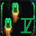

# Second Playthrou - a Starsector Mod

v0.1.0

## Description

This mod aims to improve the replayability of the game Starsector.

## Content (controlled via Luna Lib settings)

### Done

   ####  Randomizing of the Coreworlds without breaking of missions 
   - Repositioning
   - Changing of uninhabited planets
   - Partial changing of inhabited worlds 

 
   #### Repositioning of Mod factions
   - either to the core or just around the map
   - maintain each AI faction systems grouped (WIP)
   - moves UAF to the border of deep hyperspace (WIP) 
 
 
   #### Disabling access penalties for distance from the core worlds  
   -  10% Access bonus per 5000su from center of sector 
    

   #### Limit Free Storage
   - add limit to free storage or remove it completely, depending on what is more viable

   #### Custom Start Bonuses
   -  Fathers Logbook
     
      - preliminary survey data / full survey data of X(0-100) percent of planets
      - known location of hypershunts
      - known location of cryosleepers
      - X amount of hyperspace terrain data (0 to 700 to unlock the skills)

   #### Permanent Wars
   - all vanilla factions hate you
   - all non vanilla factions hate you
   - Total War (everyone hates everyone)
   - faction list vs faction list (see faction name help file for how to write the names)

### WIP

   #### Custom Start Bonuses
   - X amount of hyperspace terrain data (0 to 700 to unlock the skills)
      
   - Defect Remnant Start (Moved to its own mod)
      - you can pilot ai ships
      - you get automated ship points per player level
      - debuff that makes all ships with crew requirements above 0 have a max cr of 10 and peak combat time of 10 seconds
      - Remnants hate you and send fleets to eliminate the error that was your birth
   
   - Super Weapons Arsenal revival (Moved to its own mod)

   #### Colony Crisis speed modifier (increase or decrease point gain by a factor)
   - maybe scaling considering colony size, but Im not certain if possible
 

   #### Player Reknown 
   Affects only FleetPoints ratings for autoresolve)

   #### Notification filter
   so you dont get spammed with "Scan this derelict ship for 30k"

   #### Own faction start with more difficulty settings
   - random
   - game journalist: your own system, close to the core, perfect planets, gate, all domain era stable points
   - easy core: your own system, close to the core, nice planets, gate, 3 stable points
   - easy rim: your own system, far from the core, nice planets, gate, 3 stable points
   - medium core: your own system, close to the core, ok planets, 3 stable points
   - medium rim: your own system, far from the core, ok planets, 3 stable points
   - hard core: system with faction that hates you, bad planet, on lost planet you get 1 year to reconquer or you get game over
   - hard rim: system with remnant nexus, remnants hate you, on lost planet you get 1 year to reconquer or you get game over

   #### Faction Banners
   - I want to draw some flags

   #### Vanilla complient, but nicer portraits
   - Less ugly feminazi female looks and more normal women that know how to use make-up as a weapon.

   #### Islands in the Abyss
   - kinda already implemented on a technical level, but too lazy to make them pretty 

## FAQ

- nothing until now

## Dependencies
- [LunaLib]
- [LazyLib] 
- [MagicLib] ()

## Other

Author: mllhild
License: just have fun

[LunaLib]: https://github.com/Lukas22041/LunaLib/
[LazyLib]: https://github.com/LazyWizard/lazylib/
[MagicLib]: https://github.com/MagicLibStarsector/MagicLib/

